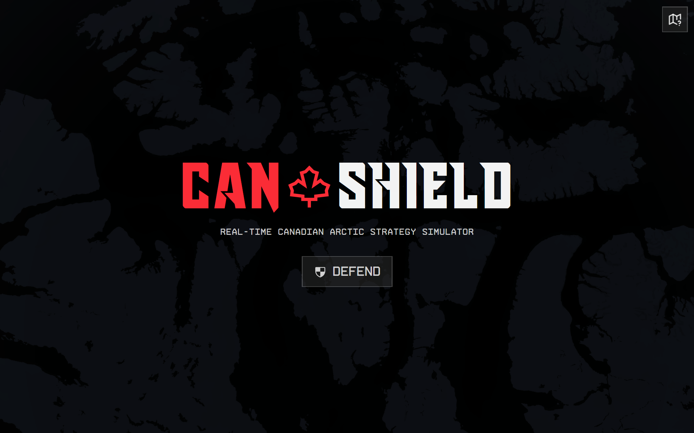
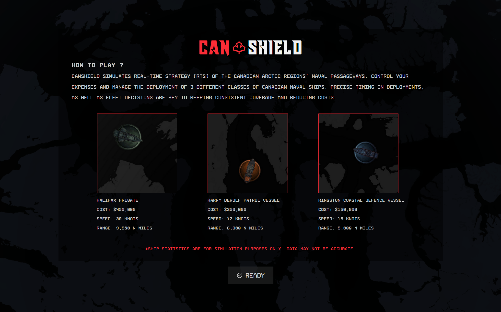
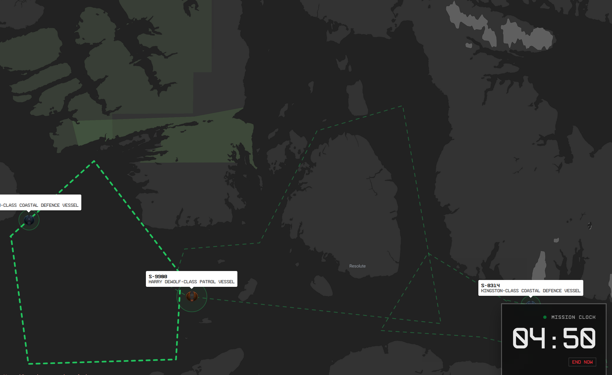
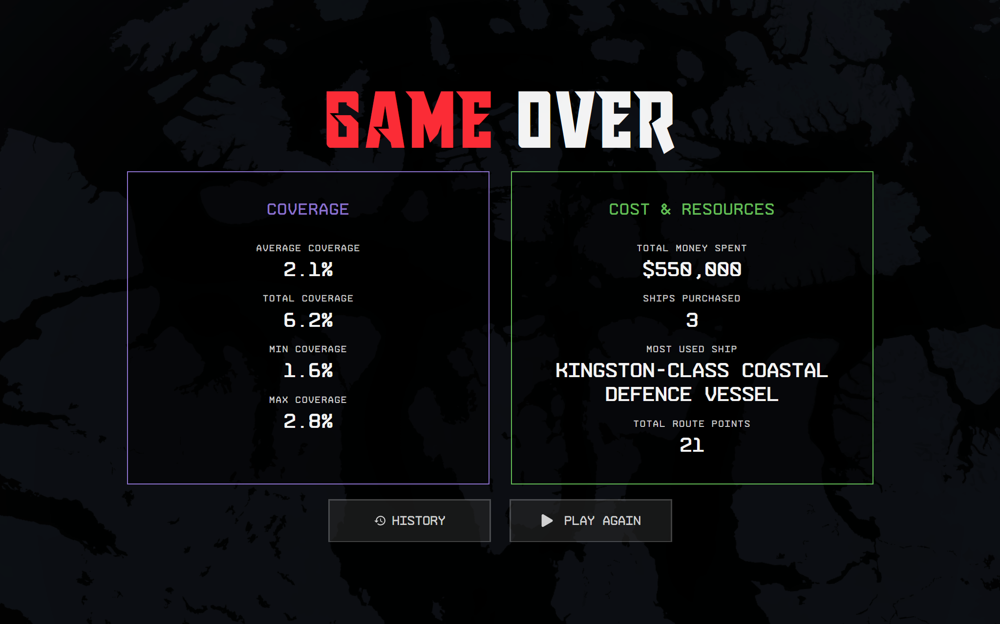
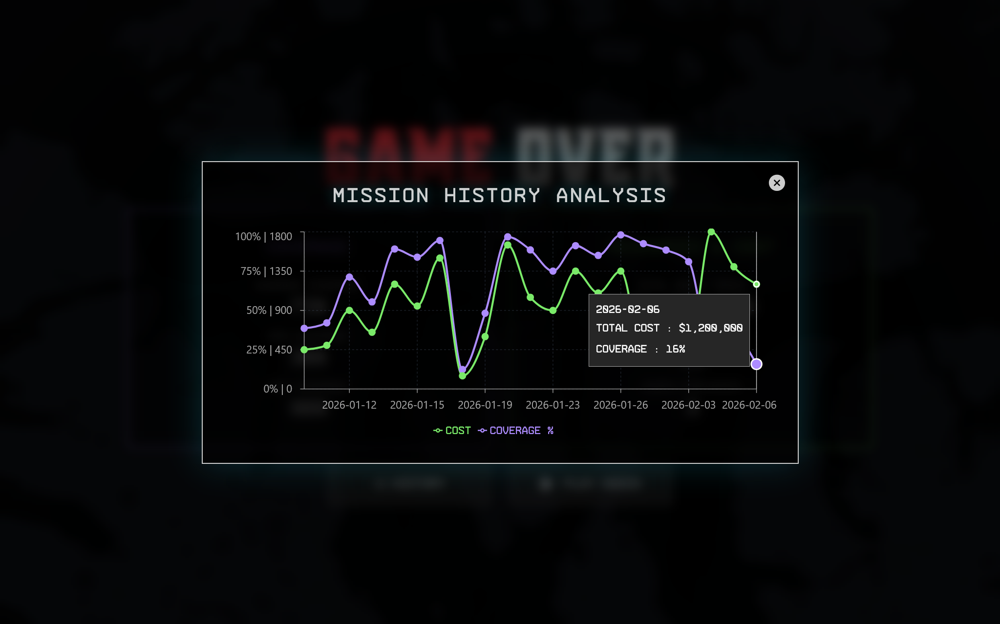

# 🛡️ CANshield

> **Thales Challenge Submission** > An Arctic passageway defense simulator designed with RTS gameplay mechanics.

## 📸 Screenshots & Demo








---

## 💡 Inspiration
This project was created to compete for the **Thales challenge** this year. We chose to participate in this challenge because of the relevancy of Arctic passageways, which are becoming more appealing thanks to global climate change and melting glaciers.

Because this is designed like a Real-Time Strategy (RTS) video game, we were inspired to mimic the visualization and core gameplay of games like *Civilization* and *Age of Empires*.

"With great power, comes great responsibility." That's what we wanted users to feel. We envision players working hard to keep the arctic maritime passageways protected.

## ❄️ Defend the Canadian Arctic

Strategically place your navy ships to patrol the most amount of area possible.

Choose between **three** different vessels

### Halifax Class Frigade
* Cost: $450,000
* Speed: 30 Knots
* Range: 9,500 N-Miles

### Harry DeWolf Patrol Vessel
* Cost: $250,000
* Speed: 17 Knots
* Range: 6,800 N-Miles

### Kingston Coastal Defence Vessel
* Cost: $150,000
* Speed: 15 Knots
* Range: 5,000 N-Miles

Choosing smart patrol routes and optimizing ressource management is key to a successful operation. Good luck officer!
## ⚙️ How we built it

### Tech Stack
* **Frontend:** React.js, Tailwind CSS, Recharts
* **Backend:** FastAPI, MongoDB
* **Infrastructure:** .tech Domains, Vercel
* **Mapping:** OpenStreetMap (Gameplay interactions), MapBox (Background rendering)

We utilized **React** for the component-based UI and **Tailwind CSS** for rapid styling. The core simulation logic runs on the client side, interacting with **OpenStreetMap** data to generate realistic geography for the Arctic region.

---

## 🚀 Getting Started

To run CANshield locally, follow these steps:

### Prerequisites
* Node.js (v16 or higher)
* npm

### Installation

1.  **Clone the repository**
    ```bash
    git clone https://github.com/your-username/CANshield.git
    cd CANshield
    ```

2.  **Install dependencies**
    ```bash
    npm install
    ```

3.  **Run the application**
    ```bash
    npm run dev
    ```
    Open [http://localhost:5173](http://localhost:5173) to view it in the browser.

---

## 🧠 Challenges we ran into
1.  **Idea Selection:** Finding an idea that we all felt comfortable committing to within the timeframe.
2.  **Project Management:** Time management and planning features effectively.
3.  **Version Control:** Dealing with complex merge conflicts during rapid iteration.

## 🏆 Accomplishments that we're proud of
1.  Settling on a unified vision that everyone was excited to build.
2.  Quickly learning and implementing React.js for complex web design.
3.  Developing a visually appealing and responsive frontend.

## 📚 What we learned
* **AI Limitations:** Don't trust AI for everything, especially algorithms that can be hard-coded or require specific context.
* **Team Dynamics:** Working as a team is challenging but rewarding when pieces come together.
* **Technical Skills:** Advanced web design patterns and React state management.

## 🔮 What's next for CANshield
We are hoping to expand on the app to allow for more repeatability and usage of our simulator with the goal of releasing an open beta.

**Roadmap:**
* [ ] Fix all bugs and improve curreny features
* [ ] Add different strategic locations around the Arctic passage.
* [ ] Implement AI-recommended paths and strategic insights.
* [ ] Create more balanced and challenging simulation options.
* [ ] Introduce "Special Events" (storms, political events) during simulations.

---

## 👥 The Team
* **Samuel Drake**
* **Thomas Pingot**
* **Yoël Makaya-Leandrine**
